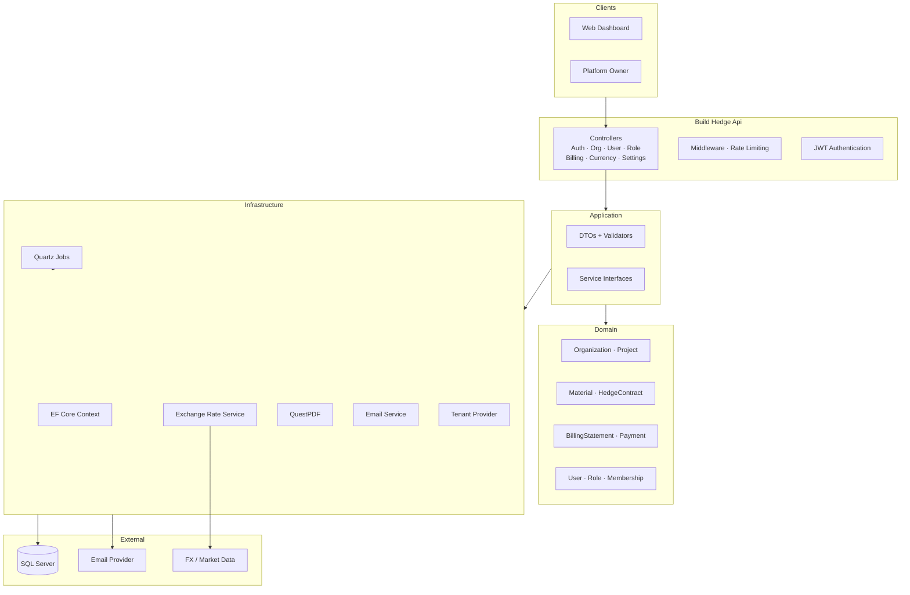
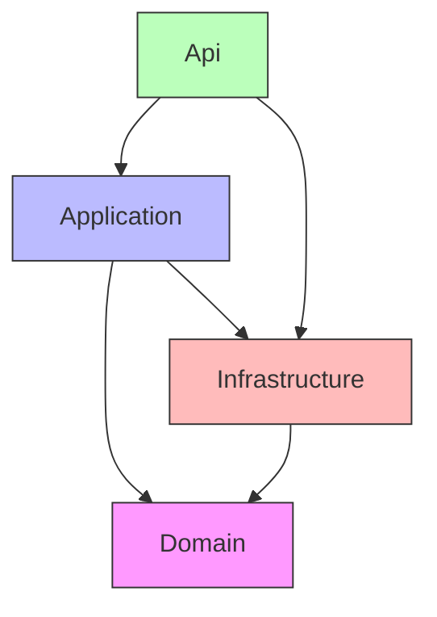
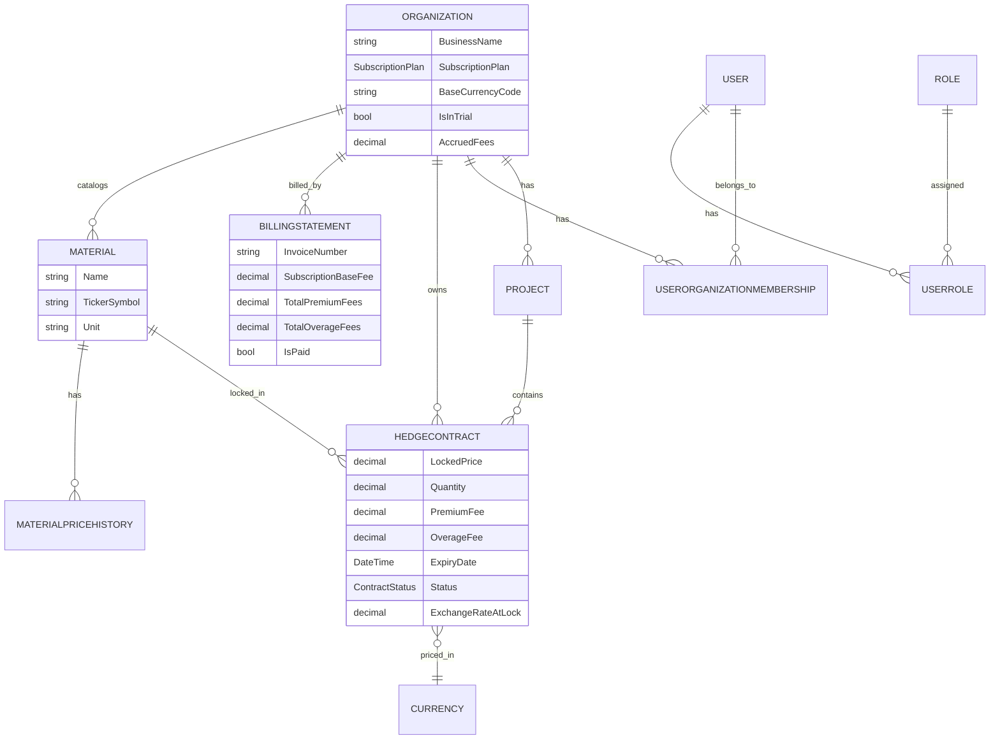
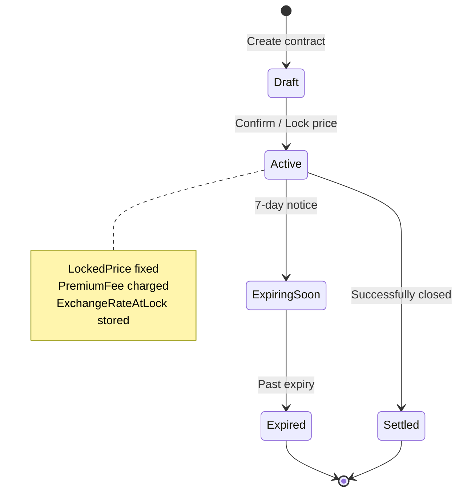
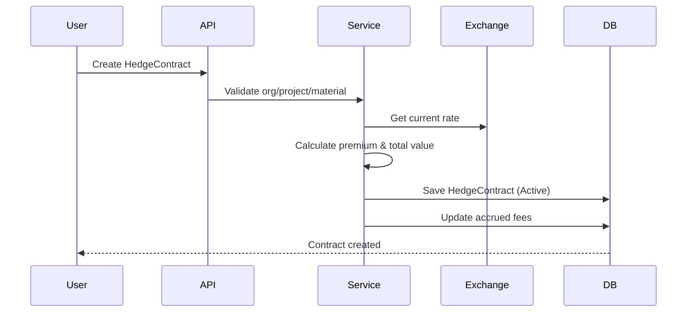
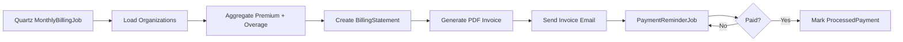
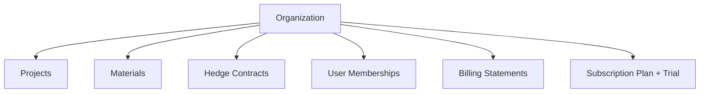
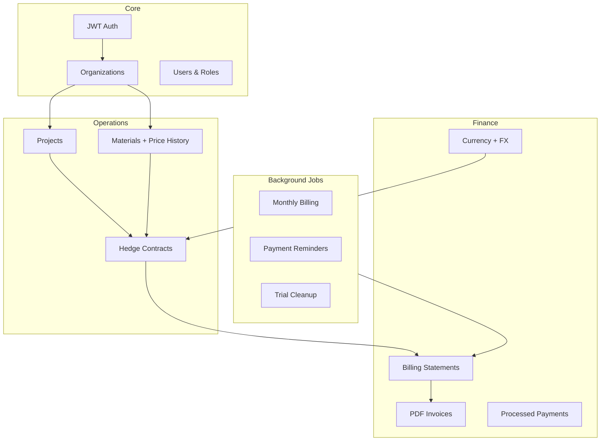
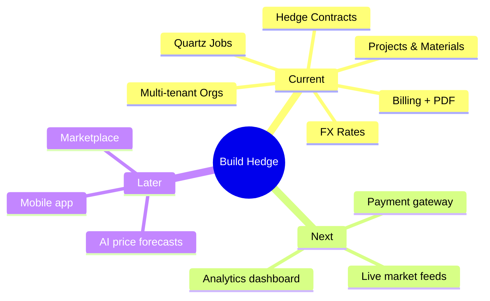

# Build Hedge API – Architecture & System Diagrams

This document contains the system architecture and key flow diagrams for the Build Hedge material price hedging platform.

---

## 1. High-Level Architecture

---

## 2. Clean Architecture Layers

---

## 3. Domain Entity Relationships

---

## 4. Hedge Contract Lifecycle

### Create Hedge Sequence

---

## 5. Billing Flow

---

## 6. Multi-Tenancy / Organization Model

---

## 7. Module Overview

---

## 8. Future Enhancements

---

**Notes**

- Diagrams are written in Mermaid and render on GitHub, GitLab, Notion, and VS Code.
- Update this file as new features are added.
